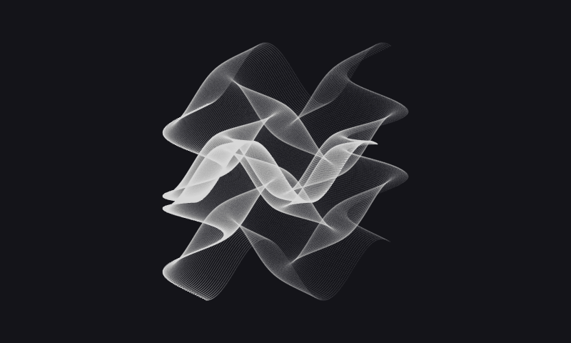
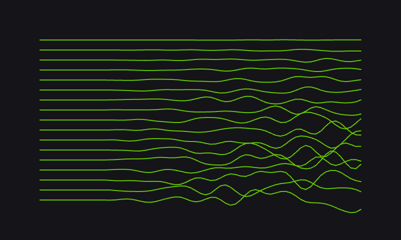

# Kowalski

Generative art for a Pimoroni Inky Impression 7.3-inch e-ink display, driven by a Raspberry Pi Zero 2 W.





The project renders a randomized Three.js scene, captures it as a PNG with headless Chromium, and sends it to the Inky display. A systemd timer refreshes the display every 10 minutes, picking a random scene each time.

## Hardware

- Raspberry Pi Zero 2 W
- Pimoroni Inky Impression 7.3-inch display
  - 800×480 pixels
  - seven-color e-ink panel
  - SPI for display data
  - I2C for display detection
- microSD card and power supply
- Network access for the initial setup and remote development loop

See the [Inky Impression guide](https://learn.pimoroni.com/article/getting-started-with-inky-impression) and the [Inky Python library](https://github.com/pimoroni/inky) for hardware details.

## Architecture

- **Artwork** (`art/scenes/`) — each module is one artwork: a self-contained Three.js program that draws one randomized 800×480 frame. The seed changes per run, so no two refreshes match.
- **Capture** (`art/capture.mjs`) — takes a scene name and an optional seed, captures the scene in headless Chromium, and saves the canvas as a PNG. Every scene ships in the bundle, so selection is a runtime choice with no rebuild; a repeated scene/seed pair reproduces the exact frame.
- **Display** (`display/`) — `show.py` picks a display mode and puts its image on the panel, letting the Inky library handle the seven-color conversion and refresh. The generative mode (default) picks a random scene and runs the capture; the image mode shows a local file.
- **Scheduling** (`systemd/`) — a systemd service performs one refresh; a timer fires it at boot and every 10 minutes.

## Raspberry Pi setup

Prerequisites: Raspberry Pi OS, a connected Inky Impression, network access, and a cloned copy of this repository.

```sh
git clone https://github.com/kapman/kowalski-pub.git ~/kowalski
cd ~/kowalski
./scripts/pi/bootstrap.sh
```

The bootstrap script:

- enables SPI and I2C;
- installs Python, Chromium, and build dependencies;
- installs Node.js 22 through fnm;
- builds the artwork bundle;
- creates `.venv` and installs Inky and Pillow; and
- installs and enables the systemd service and timer.

Run the script as the Pi user from the repository checkout. It generates the systemd service paths from that checkout, so the repository can live anywhere.

## Local art development

Requires Node.js and npm on your development machine.

```sh
cd art
npm ci
npm run dev
```

Open the Vite URL printed by the command — it loads a random scene; append `?scene=<name>` to preview a specific one. The scene is sized to 800×480 so the browser preview matches the display. Build and capture a frame with:

```sh
npm run build
node capture.mjs --scene formula-grid --out images
```

Generated captures in `art/images/` are ignored by Git.

## Remote development loop

The scripts in `scripts/dev/` connect to the Pi over SSH and assume a working setup first:

1. SSH is enabled on the Pi: in Raspberry Pi Imager under "Services", or with `sudo raspi-config` → Interface Options → SSH.
2. Passwordless key authentication is configured from your development machine:

   ```sh
   ssh-keygen -t ed25519        # if you do not have a key yet
   ssh pi@raspberrypi.local     # accept the host key, enter the Pi's password
   ssh-copy-id pi@raspberrypi.local
   ssh pi@raspberrypi.local 'echo ok'   # should print "ok" with no prompt
   ```

3. `rsync` is installed on your development machine.
4. The Pi has been bootstrapped (see Raspberry Pi setup), so `~/kowalski/.venv` exists.

`raspberrypi.local` is the Pi's default hostname, advertised over mDNS on the same local network — no DNS server involved. If it does not resolve, use the Pi's IP address instead, for example `pi@192.168.1.42`.

Then set the SSH target for your own Pi; it is intentionally not stored in the repository:

```sh
export PI_HOST=pi@raspberrypi.local
./scripts/dev/push.sh
```

This syncs the checkout to `~/kowalski-dev` and refreshes the display (generative mode by default) using the Python environment from `~/kowalski`. Use `./scripts/dev/push.sh --main` when deploying changes that affect the bootstrap script or systemd units.

To shut down the Pi remotely:

```sh
./scripts/dev/down.sh
```

This runs `sudo shutdown` over SSH, which requires passwordless sudo for the Pi user (`pi ALL=(ALL) NOPASSWD: ALL` in `sudo visudo`).

## Repository layout

```text
art/                  Three.js scenes, headless frame capture, and build config
display/              Display entrypoint and modes
assets/images/        Sample images for the image mode
scripts/dev/          Local-to-Pi sync and shutdown helpers
scripts/pi/           One-time Pi bootstrap script
systemd/              Service and timer templates
```
